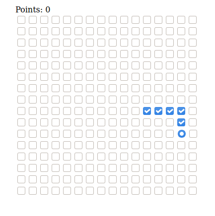

# Compose-Snake-Web
This is a [Compose for Web](https://compose-web.ui.pages.jetbrains.team/) port of [CompoSnake](https://github.com/arkivanov/CompoSnake). I used the code from there and modified it, to make it work in web.



You can try it [HERE](https://foso.github.io/compose-snake-web/index.html)

### Running web application
```
./gradlew jsBrowserRun
```
